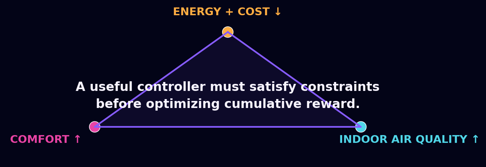
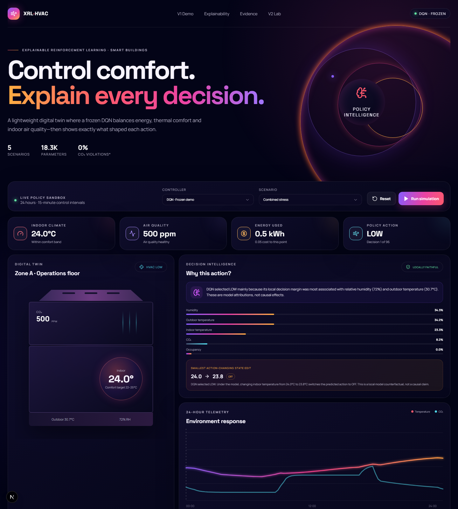
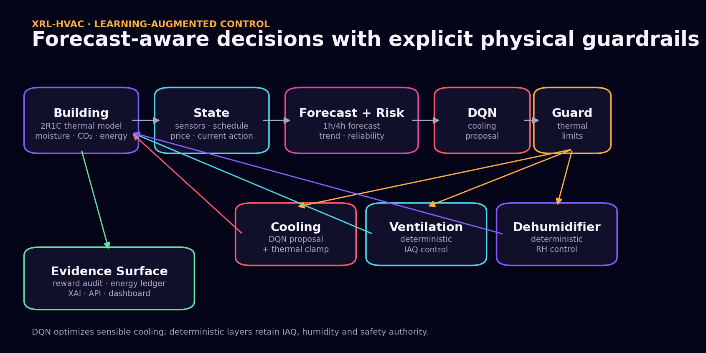
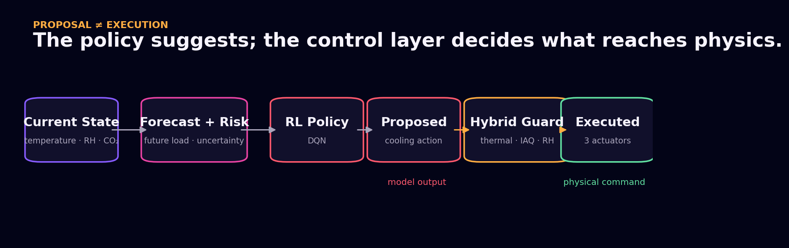
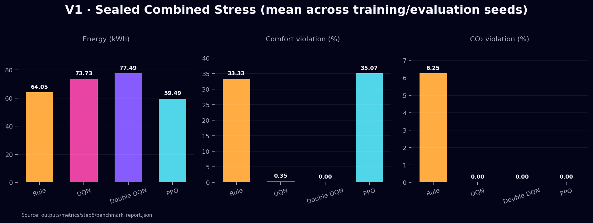
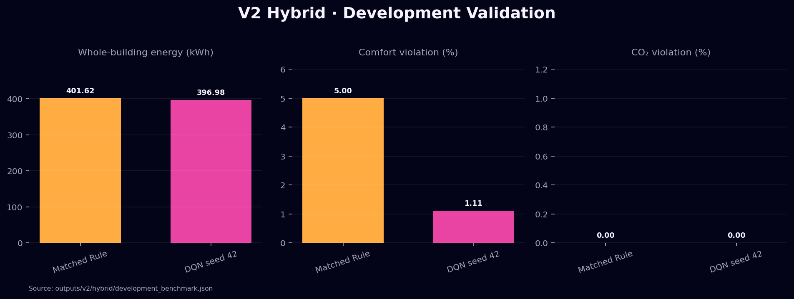
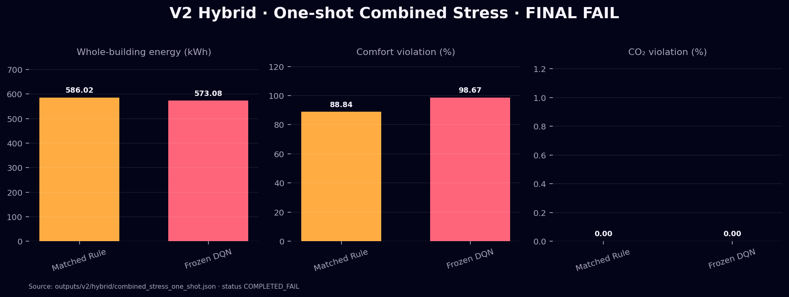
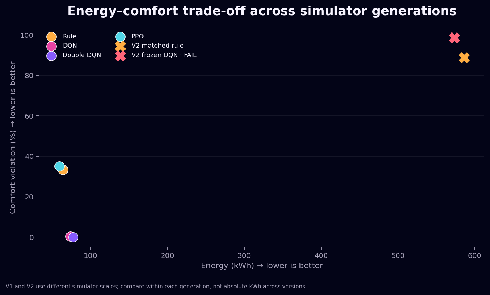

<div align="center">

# XRL-HVAC

### Explainable & Safe Reinforcement Learning for Smart Building HVAC Control

A learning-augmented smart-building controller that combines reinforcement learning, lightweight building physics, forecasting, risk analysis, deterministic guardrails, and explainability.

[Dashboard](#interactive-dashboard) · [Architecture](#system-architecture) · [Results](#benchmark-evidence) · [Quick Start](#quick-start)


</div>

> HVAC control is not a single-objective “use less electricity” problem. A useful policy must reduce energy and cost without sacrificing thermal comfort or indoor air quality—and it must remain safe when forecasts or operating conditions change.



## Interactive dashboard

The Next.js control room replays a deterministic 24-hour simulation, visualizes the building state and telemetry, and exposes the model attribution and verified local counterfactual behind each DQN action.



<table>
  <tr>
    <td align="center"><strong>99.0% ↓</strong><br><sub>V1 comfort violations<br>vs Rule-Based</sub></td>
    <td align="center"><strong>100% ↓</strong><br><sub>V1 CO₂ violations<br>vs Rule-Based</sub></td>
    <td align="center"><strong>2.2% ↓</strong><br><sub>V2 held-out energy<br>but final gate failed</sub></td>
    <td align="center"><strong>149</strong><br><sub>Python tests<br>passing</sub></td>
  </tr>
</table>

The honest headline is two-part: **V1 proved a balanced learned policy on its sealed test; V2 improved the engineering stack and reduced held-out energy, but failed its locked comfort gate.** The failed result is retained as evidence—not tuned away.

## System overview



The final V2 architecture is deliberately **learning-augmented**, not fully autonomous. DQN proposes sensible cooling. A thermal guard may clamp that proposal, while deterministic ventilation and dehumidification controllers retain authority over IAQ and latent moisture. Every actuator is included in the energy and Time-of-Use cost ledger.



## V1 → V2

| Capability | V1 — frozen demo | V2 — closed engineering iteration |
|---|---|---|
| Simulator | Lightweight single-zone model | 2R1C thermal mass + correlated weather and internal gains |
| Controller | Reactive frozen DQN | DQN cooling proposal + deterministic actuator coordination |
| Forecast / risk | — | 1h/4h forecasts, uncertainty, trends, reliability, bounded risk |
| Safety | Action constraints | Predictive shield experiments + final thermal guard |
| Cooling / ventilation | Coupled discrete action | Independent physical commands |
| Dehumidification | Coupled to HVAC cooling | Independent, separately metered 8 kg/h actuator |
| Energy accounting | HVAC energy and cost | Cooling, fan, dehumidifier, lighting, electronics, base and cleaning loads |
| XAI | Attribution + counterfactual | Policy and guard/shield records kept separate |
| Final evidence | **Held-out PASS** | **One-shot held-out FAIL — comfort** |

```text
V1 reactive DQN
        ↓
Energy–comfort trade-off discovered
        ↓
Richer physics + locked V2 protocol
        ↓
Failure diagnosis and physics ablations
        ↓
Coupled actuator / control-authority mismatch
        ↓
Learning-augmented cooling + ventilation + dehumidification
        ↓
Development PASS → one-shot Combined Stress FAIL
```

## System architecture

- **Simulator:** seeded Gymnasium episodes, 96 × 15-minute steps, single-zone 2R1C temperature dynamics, moisture, occupancy/airflow-coupled CO₂ and detailed heat flows.
- **Context:** scenario generator, Time-of-Use price, forecast uncertainty, online signal monitoring, reliability and observable risk features.
- **Control:** Q-Learning, DQN, Double DQN and PPO were benchmarked in V1. SAC was a V2 go/no-go experiment and was stopped after failing the locked first-seed gate.
- **Safety:** the learned output is a proposal. Deterministic logic records proposed and executed commands and the reason for intervention.
- **XAI:** local feature attribution, action-flip counterfactuals and trajectory explanations; outputs explicitly avoid causal claims.
- **Delivery:** typed FastAPI services, a themed Next.js dashboard, Docker, versioned configs, SHA-verified checkpoints and machine-readable evidence.

Deeper design notes live in [architecture.md](docs/architecture.md).

## Explain every decision

A real V1 held-out explanation from the frozen demo checkpoint:

```text
DQN proposal: HIGH

Strongest local association:
Outdoor temperature  40.3°C  ███████████████████  38.0%
Occupancy             40      ███████              14.1%

Verified counterfactual:
Indoor 23.6°C → HIGH
Indoor 23.2°C → MEDIUM
```

This is a **local model sensitivity explanation**, not proof that changing one feature physically causes the action. Counterfactuals are bounded and accepted only when inference verifies the action flip. V2 development artifacts additionally record the policy proposal separately from deterministic shield execution—for example, `LOW → MEDIUM` under a humidity-risk clamp.

Sources: [`step6_xai_report.json`](outputs/trajectories/xai/step6_xai_report.json) and [`v2_development_xai_samples.json`](outputs/v2/xai/v2_development_xai_samples.json).

## Benchmark evidence

### V1 — sealed Combined Stress: PASS

V1 used three training seeds and five held-out evaluation seeds. DQN was selected by validation/test trade-off evidence, not reward alone.



| Controller | Energy | Comfort violation | CO₂ violation | Interpretation |
|---|---:|---:|---:|---|
| Rule-Based | 64.05 kWh | 33.33% | 6.25% | Efficient, constraint violations |
| **DQN** | **73.73 kWh** | **0.35%** | **0.00%** | Official balanced demo |
| Double DQN | 77.49 kWh | **0.00%** | **0.00%** | Stronger comfort, higher energy |
| PPO | **59.49 kWh** | 35.07% | **0.00%** | Energy-oriented policy |

### V2 hybrid — development validation: PASS

After diagnosing the actuator mismatch, the frozen DQN seed 42 candidate beat a Rule-Based controller using the **same** cooling, ventilation and dehumidification hardware.



| Controller | Whole-building energy | Cost | Comfort | CO₂ | Safety |
|---|---:|---:|---:|---:|---:|
| Matched Rule-Based | 401.62 kWh | 90.86 | 5.00% | 0.00% | 0 critical |
| **DQN seed 42 + hybrid guard** | **396.98 kWh** | **90.73** | **1.11%** | **0.00%** | **0 critical** |

### V2 hybrid — one-shot Combined Stress: FINAL FAIL

The frozen bundle was hashed before the test. Combined Stress was then opened once across seeds `1701–1705`; reruns are prohibited by the receipt.



The candidate reduced energy from `586.02` to `573.08 kWh` and cost from `221.10` to `218.47`, while keeping CO₂ violations at zero. It nevertheless failed decisively: comfort violation reached **98.67%**. The matched Rule-Based controller also reached **88.84%**, indicating that actuator capacity under combined heat and humidity was a major limitation; the DQN’s weaker comfort result also shows remaining policy-generalization error.



V1 and V2 use different simulator scales. Absolute kWh must be compared **within**, not across, simulator generations. Full evidence: [V2 results](docs/v2-results.md), [frozen manifest](outputs/v2/hybrid/frozen_candidate_manifest.json), and [one-shot receipt](outputs/v2/hybrid/combined_stress_one_shot.json).

## From failure to better system design

```text
BEFORE                                  AFTER
Cooling + ventilation                   Sensible cooling ← DQN + guard
through one ordinal action      →       IAQ ventilation  ← deterministic
        +                               Dehumidification ← deterministic
latent moisture + infiltration
```

Controlled ablations showed that occupant latent moisture and infiltration—not simply network size or DQN tuning—created the dominant comfort/IAQ conflict. The hybrid redesign passed development, but the sealed test revealed a second boundary: **decoupled authority is necessary, yet current actuator capacity is not sufficient for extreme combined load.**

## Technology

| Layer | Technology |
|---|---|
| RL | PyTorch, custom Q-Learning/DQN/Double DQN, Stable-Baselines3 PPO/SAC experiment |
| Environment | Gymnasium, NumPy, custom 2R1C and psychrometric model |
| Forecast / risk | Seeded profile forecaster, EWMA/CUSUM monitoring, reliability tracking |
| XAI | Integrated Gradients, local Q-margin ablation, bounded counterfactual search |
| API / UI | FastAPI, Pydantic, Next.js 16, React 19, TypeScript |
| Infrastructure | Docker Compose, YAML/JSON experiment configs, SHA-256 manifests |
| Verification | Pytest, TypeScript typecheck, Next.js production build |

## Quick start

### Docker

```bash
docker compose up --build
```

Open the dashboard at `http://localhost:3000` and API docs at `http://localhost:8000/docs`.

### Local — Windows PowerShell

```powershell
python -m venv .venv
.\.venv\Scripts\Activate.ps1
python -m pip install --upgrade pip
python -m pip install -r requirements.txt
.\.venv\Scripts\python.exe scripts\start_demo.py
```

In a second terminal:

```powershell
cd frontend
npm.cmd install
npm.cmd run dev
```

Verification:

```powershell
.\.venv\Scripts\python.exe -m pytest -q
cd frontend
npm.cmd run typecheck
npm.cmd run build
```

The demo workflow is intentionally simple:

```text
Choose scenario → choose controller → run 24h simulation
       → replay the building → inspect DQN/XAI → compare evidence
```

## Repository map

```text
XRL-HVAC/
├── src/
│   ├── envs/          # V1 + versioned V2/hybrid physics
│   ├── agents/        # Q-Learning, DQN, Double DQN, PPO/SAC
│   ├── shields/       # Predictive shield + hybrid guard
│   ├── xai/           # attribution, counterfactual, trajectory XAI
│   └── evaluation/    # constraint-first benchmarks
├── api/               # FastAPI application
├── frontend/          # Next.js control room
├── configs/           # reproducible experiment definitions
├── models/            # frozen demo/candidate checkpoints
├── outputs/           # machine-readable evidence and receipts
├── tests/             # simulator, agent, XAI and API tests
└── docs/              # architecture, setup and result detail
```

## Limitations

- This is a single-zone simulation, not a physical-building deployment or EnergyPlus replacement.
- The 2R1C, airflow and dehumidifier models are calibrated engineering approximations.
- No real BMS integration or equipment telemetry is included.
- V2 is learning-augmented: deterministic layers perform substantial IAQ, humidity and safety work.
- V2 failed the final comfort gate; Combined Stress is now an observed regression case and must not be reused for model selection.
- Model explanations are local/associational and are not presented as physical causality.

## Focused roadmap

1. Establish actuator feasibility with an oracle/MPC controller before further RL training.
2. Add enthalpy-aware ventilation/energy recovery and calibrated latent/reheat dynamics.
3. Train the policy directly inside the hybrid environment and create a new untouched V3 held-out split.
4. Validate against BOPTEST/EnergyPlus, then explore multi-zone and BMS shadow-mode operation.

---

Built as an evidence-first AI engineering portfolio project: successful results, failed gates, checkpoints, and decision receipts are all preserved.
